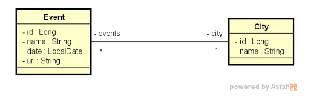

# Desafio TDD Event City

## Descrição

Sistema de eventos e cidades desenvolvido com **Test-Driven Development (TDD)** utilizando Java 21 e Spring Boot.

O projeto implementa um modelo de domínio com relacionamento N-1 entre Event e City, onde múltiplos eventos podem estar associados a uma mesma cidade.

## Modelo de Domínio

## Objetivo

Implementar as funcionalidades necessárias para que os testes automatizados do projeto passem, seguindo a abordagem TDD.

## Requisitos Técnicos

- Java 21
- Spring Boot 3

## Desenvolvido durante

Curso Java Spring Expert - DevSuperior